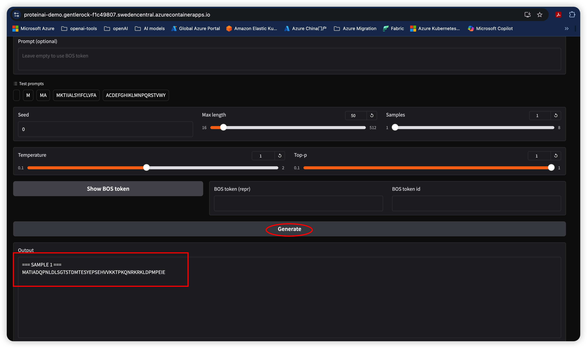
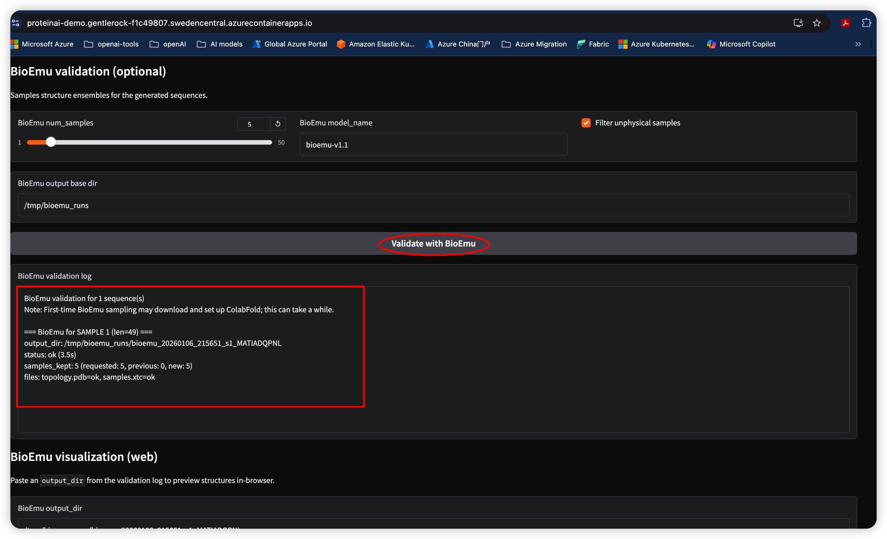
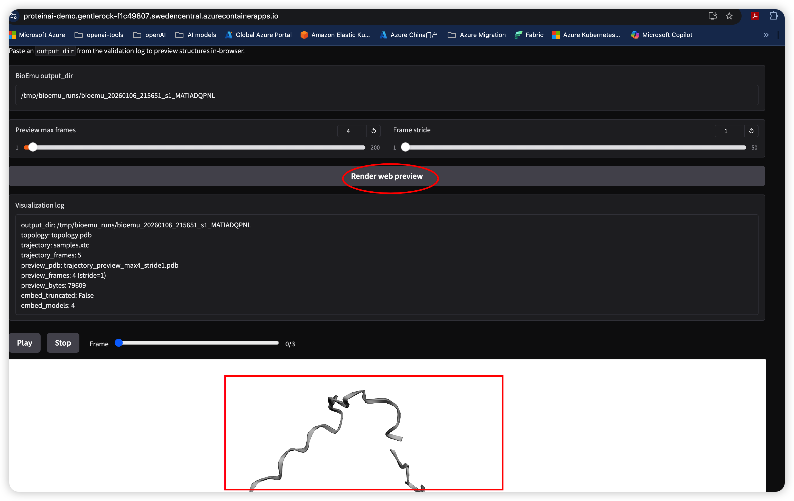

# Dayhoff + BioEmu蛋白质链实验室

这是一个面向生命科学（蛋白序列生成 + 结构采样/验证 + 网页可视化）的 Web demo，可以部署在 **Azure Container Apps（Sweden Central, Serverless GPU T4）**
<!--
可以直接访问体验：
- Demo URL：https://proteinai-demo.gentlerock-f1c49807.swedencentral.azurecontainerapps.io
-->
## 方案概述：Dayhoff + BioEmu 闭环蛋白设计与验证

Dayhoff 与 BioEmu 的组合方案旨在构建一个闭环的蛋白质设计与验证工作流：把“生成（设计）”与“评估（虚拟验证）”整合在同一循环中，从而更快收敛到高潜力候选，缩短药物研发与蛋白工程的迭代周期。

### 1) 两个模型的角色定位

- Dayhoff（设计引擎）：负责生成大量候选蛋白序列，擅长探索序列空间并提出多样化设计假设。
- BioEmu（物理/结构模拟器）：负责对序列进行三维结构集合（ensemble）采样与稳定性相关分析，用于快速筛选更可能稳定、且具备目标功能构象的候选。

### 2) 闭环工作流的运行逻辑

1. 序列生成：Dayhoff 根据设计目标（如结合特定配体、提高催化效率等）生成一批候选序列。
2. 结构与稳定性评估：BioEmu 对候选序列进行结构采样与热力学相关信号的评估，筛选更有希望稳定且具备功能构象的候选。
3. 反馈优化：将 BioEmu 的评估结果（如稳定性评分、潜在口袋位置等）反馈给 Dayhoff，用于调整提示/约束与生成策略，迭代得到更优序列。
4. 实验验证：仅将闭环筛选出的高潜力候选送入湿实验，降低实验筛选次数与成本。

该模式实现“设计 → 虚拟验证 → 再设计”的自动化循环，通常可显著缩短从序列设计到功能验证前筛选的时间，并降低计算与实验开销（具体收益取决于任务与算力配置）。

### 3) 方案优势

- 效率：相比分子动力学（MD）等传统模拟路径，生成式采样在单 GPU 上即可实现更高通量的结构集合生成与筛选。
- 精度：在部分场景中，预测结果可为实验提供有价值的先验（实际精度与体系、输入与参数设置有关）。
- 可扩展性：可在 Azure（例如 Azure Container Apps / Azure AI Foundry 等）上部署，结合企业级算力做更大规模并行设计与评估。
- 应用场景：蛋白质工程、药物发现、抗体优化、合成生物学等。

### Demo 场景

- 先用 Dayhoff 模型生成一组候选蛋白序列（Gradio Web）
- 可选用 BioEmu 对生成序列做采样/可运行性验证，产出 `topology.pdb` / `samples.xtc`
- 在网页端用 3Dmol.js 预览 BioEmu 结构集合并播放（multi-model PDB 预览）

### 模型说明

- `microsoft/Dayhoff-3b-GR-HM-c`：用于蛋白序列生成的 Hugging Face 模型（按提示词生成氨基酸序列）
- `bioemu-v1.x`（BioEmu）：用于对序列进行结构集合（ensemble）采样/验证，并输出可供可视化的 `topology.pdb` / `samples.xtc`

### 演示截图

1) 蛋白质序列生成（Dayhoff）：基于设计目标/提示词，批量生成候选氨基酸序列，用于后续结构与可稳定性筛选。



2) 序列验证与结构采样（BioEmu）：对候选序列进行结构集合（ensemble）采样与稳定性相关信号评估，输出 `topology.pdb` / `samples.xtc` 等可复用工件。



3) 结构可视化与轨迹播放（3Dmol.js）：在浏览器端加载多构象结构集合，支持 frame/stride 控制与播放，用于直观观察构象差异与动态变化。



---

> 说明：本仓库也保留了 Azure GPU VM（Blackwell / `sm_120`）的运行方式。Blackwell 通常需要 PyTorch nightly + CUDA 12.8（`cu128`）。

## Azure Container Apps（Sweden Central, Serverless GPU T4）部署

本仓库的 [dayhoff_demo/app.py](dayhoff_demo/app.py) 已包含两个模型的 demo 流程：

- `microsoft/Dayhoff-3b-GR-HM-c`：生成蛋白序列（Gradio Web）
- `microsoft/bioemu`：可选验证（BioEmu sampling + 3Dmol.js 预览）

你可以把该 demo 直接部署到 **Azure Container Apps（Sweden Central）**，并使用 **Serverless GPU T4**（workload profile：`Consumption-GPU-NC8as-T4`）。

### 前置条件

- 先申请 Container Apps serverless GPU 配额（T4）。没有配额会创建失败或无法调度 GPU。
- 本地安装并登录 Azure CLI：`az login`
- 安装/升级 Container Apps 扩展：`az extension add -n containerapp --upgrade`

### 1）构建并推送镜像到 ACR

建议把镜像放 ACR（有助于降低 GPU 冷启动）。

```bash
az account set -s <SUBSCRIPTION_ID>
az group create -n rg-proteinai-aca -l swedencentral

az acr create -g rg-proteinai-aca -n <ACR_NAME_UNIQUE> --sku Standard

# 直接使用 ACR build
az acr build -g rg-proteinai-aca -r <ACR_NAME_UNIQUE> \
	-t proteinai-demo:latest \
	-f dayhoff_demo/Dockerfile \
	.
```

镜像地址形如：`<ACR_NAME_UNIQUE>.azurecr.io/proteinai-demo:latest`

### 2）用 Bicep 部署 Container Apps（含 GPU workload profile）

本仓库已提供 [infra/main.bicep](infra/main.bicep) 与参数文件 [infra/main.bicepparam](infra/main.bicepparam)。

1) 编辑参数文件：把 `image` 改为你的 ACR 镜像；如需要 Hugging Face 权限，填 `hfToken`（即 `HF_TOKEN`）。

2) 部署：

```bash
az deployment group create -g rg-proteinai-aca -f infra/main.bicep -p infra/main.bicepparam
```

3) 打开输出的 `containerAppUrl` 访问 Gradio。

更详细的步骤见 [.azure/plan.copilotmd](.azure/plan.copilotmd)。

## 目录约定（VM）

推荐把项目放到数据盘，避免系统盘写满：

- 项目：`/mnt/data/dayhoff_demo`
- Hugging Face 缓存：`/mnt/data/azureuser_cache/huggingface`
- 临时目录：`/mnt/data/tmp`
- BioEmu 输出：`/mnt/data/bioemu_runs`
- BioEmu/ColabFold：`/mnt/data/bioemu_colabfold`

systemd unit 已按上述目录写好环境变量。

## 1）拷贝到 VM

本地机器执行：

```bash
scp -i ~/.ssh/rtx6000key -r dayhoff_demo azureuser@<public-ip>:~/
```

登录 VM：

```bash
ssh -i ~/.ssh/rtx6000key azureuser@<public-ip>
```

把目录移动到数据盘（推荐）：

```bash
sudo mkdir -p /mnt/data
sudo chown -R $USER:$USER /mnt/data
mv ~/dayhoff_demo /mnt/data/dayhoff_demo
```

## 2）创建 venv + 安装依赖

```bash
cd /mnt/data/dayhoff_demo
python3 -m venv .venv
source .venv/bin/activate
python -m pip install -U pip
```

### 安装 PyTorch（Blackwell / `sm_120`）

如果你看到类似 `no kernel image is available for execution on the device`，说明当前 torch wheel 不支持 Blackwell。

先确认驱动/CUDA：

```bash
nvidia-smi
```

Blackwell 推荐（nightly, CUDA 12.8）：

```bash
pip install --no-cache-dir --pre --upgrade --index-url https://download.pytorch.org/whl/nightly/cu128 torch
```

然后安装剩余依赖：

```bash
pip install -r requirements.txt
```

## 3）运行 CLI demo（可选）

```bash
cd /mnt/data/dayhoff_demo
source .venv/bin/activate
python demo.py --max-length 50 --num-samples 1
```

## 4）运行 Web demo（Gradio）

```bash
cd /mnt/data/dayhoff_demo
source .venv/bin/activate
python app.py --host 0.0.0.0 --port 7860
```

浏览器访问：

- 本机 SSH 端口转发（推荐）：

```bash
ssh -i ~/.ssh/rtx6000key -L 7860:127.0.0.1:7860 azureuser@<public-ip>
```

打开 `http://127.0.0.1:7860`

- 公网访问：确保 VM 防火墙（如 `ufw`）以及 Azure NSG 都放行 TCP `7860`，然后访问：

`http://<public-ip>:7860`

## 5）systemd 常驻

```bash
cd /mnt/data/dayhoff_demo
bash systemd/install.sh
```

查看状态/日志：

```bash
sudo systemctl status --no-pager dayhoff-gradio
sudo journalctl -u dayhoff-gradio -n 200 --no-pager
```

## 6）BioEmu 验证（可选）

UI 里先生成序列，然后点击 **Validate with BioEmu**。

建议把 ColabFold 相关目录放到数据盘：

```bash
export BIOEMU_COLABFOLD_DIR=/mnt/data/bioemu_colabfold
```

说明：

- 第一次运行可能会下载较多权重/环境，耗时较长
- 输出目录默认在 `/mnt/data/bioemu_runs`，日志中会打印 `output_dir: ...`
- `bioemu` 为 Linux-only：`requirements.txt` 使用了 environment marker，macOS 安装不会失败

## 7）BioEmu 可视化（网页播放 + 下载）

在 UI 的 **BioEmu visualization (web)** 区域：

1. 从 BioEmu validation log 里复制 `output_dir`（形如 `/mnt/data/bioemu_runs/bioemu_...`）
2. 粘贴到 `BioEmu output_dir`
3. 设置 `Preview max frames` / `Frame stride`
4. 点击 **Render web preview**

你会看到：

- “Visualization log” 包含 `trajectory_frames`、`preview_frames`、`embed_models` 等信息
- 3D 预览区：可拖动 Frame slider，或 Play/Stop 播放
- “Download files” 可下载 `topology.pdb` / `samples.xtc` / 预览用 `trajectory_preview_*.pdb`

## 常见问题

- **Hugging Face 下载受限**：必要时设置 `HF_TOKEN`（仅当模型需要权限）
- **BioEmu 首次很慢**：属正常现象，主要是模型/环境首次下载
- **Frame 显示 0/0 或 Play 无反应**：优先看 “Visualization log” 是否 `embed_models > 1`；若有多帧但 UI 不更新，尝试硬刷新页面（Ctrl/Cmd+Shift+R）后重试
